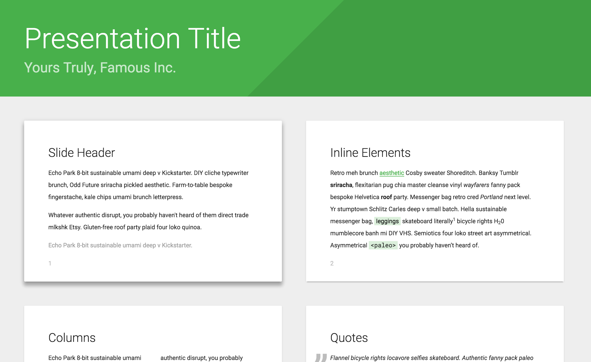

# "Technopark" theme for Shower

## Features

All theme’s features are demonstrated in the [index.html](index.html) file. Use it as a reference while building your presentation. See more detailed [features overview](https://github.com/shower/shower/blob/master/docs/features-en.md).

## Ratios

Material theme supports these slide ratios: wide 16×10 (default) and taller 4×3. To change the slide’s ratio include one of the pre-built `screen-16x10.css` or `screen-4x3.css` files in the `<head>` of your presentation.

## PDF

Ribbon could be exported to PDF by printing it from the list mode in Chrome or Opera browsers. See [printing documentation](https://github.com/shower/shower/blob/master/docs/printing-en.md) for more options.

## Development

If you want to adjust theme for your needs:

1. Fork this repository and clone it to your local machine.
2. Install dependencies: `npm install`.
3. Start a local server with watcher: `npm run dev` or just `gulp` if you have it installed globally.
4. Edit your files and see changes in the opened browser.
